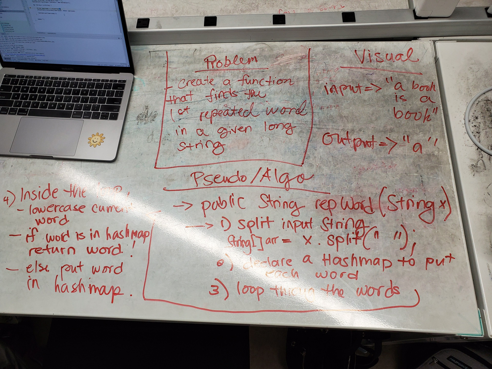
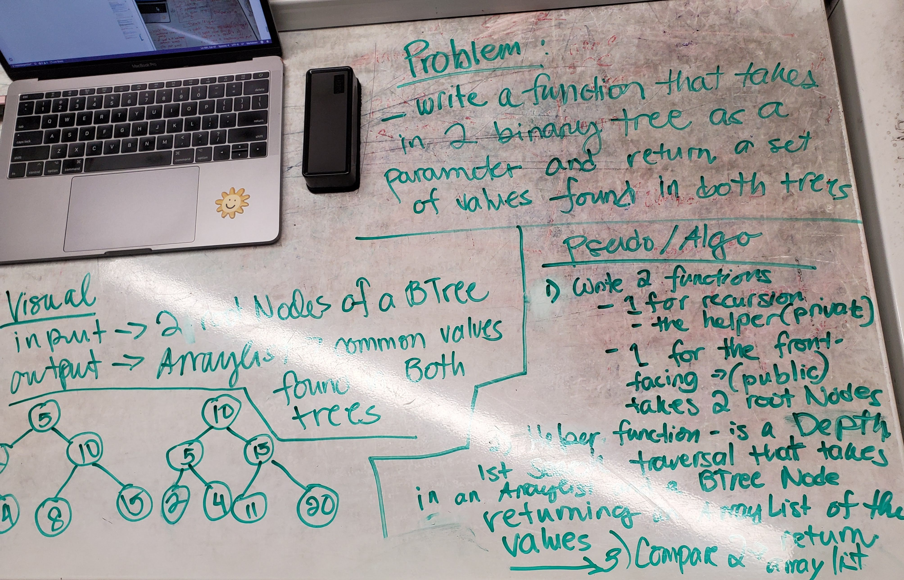
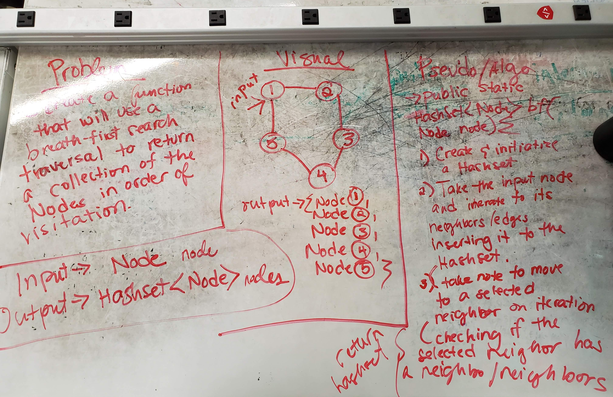

# Data Structures and Algorithms

This repository is a collection of code with some basic solutions on some common programming problems. Programming language used in this repo is Javascript and Java. 

## Table of Contents
1. [Reverse an Array](#reverse-an-array)
2. [Shift an Array](#shift-an-array)
3. [Binary Search](#binary-search)
4. [Singly Linked List](#singly-linked-list)
5. [Singly Linked List - Insertions (Extended)](#singly-linked-list-insertions)
6. [Singly Linked List - Kth From End (Extended)](#singly-linked-list-kth-from-end)
7. [Stacks & Queues](#stacks-and-queues)
8. [Queues With Stacks](#queues-with-stacks)
9. [Animal Shelter Exercise](#animal-shelter)
10. [Multi Bracket Validation](#multi-bracket-validation)
11. [Trees](#trees)
12. [FizzBuzz](#fizzbuzz)
13. [Breath-First Traversal - Binary Tree](#breadth-first-traversal)
14. [Find Max Value of Binary Tree](#find-max-value-binary-tree)
15. [Hashtables](#hashtables)
16. [Repeated Word](#repeated-word)
17. [Tree Intersection](#tree-intersection)
18. [Graphs](#graphs)
19. [Hashmap LEFT JOIN](#hashmap-left-join)

## Reverse an Array

### Challenge
Write a function called reverseArray which takes an array as an argument. Without utilizing any of the built-in methods available to your language, return an array with elements in reversed order.

### Approach & Efficiency
My apporach was to loop through the array half its length and exchange the values on opposite ends of the array. It has a time-complexity of O(n). 

### Solution

### [Code](./code-challenges/array_reverse)

## Shift an Array

### Challenge
Write a function called insertShiftArray which takes in an array and the value to be added. Without utilizing any of the built-in methods available to your language, return an array with the new value added at the middle index.

### Approach & Efficiency
My apporach was to create a new array 1 element more than the length of the passed in array. I also created an integer variable to store the middle index, dividing length to half. After creating a new array with the proper length for the shift, I looped through the array assigning the same values as the values on the same index of the passed in array for up to half its length. On current index in loop equalling to the middle index, I assign the passed in integer parameter. In continuation, the rest of the array will be assigned same as the values on the passed in array but setting its index minus 1 to accomodate the inserted middle element. This has a time-complexity of O(n) because of its linear approach. 

### Solution

### [Code](./code-401-challenges/src/main/java/code/challenges/ArrayShift.java)

## Binary Search

### Challenge
Write a function called BinarySearch which takes in 2 parameters: a sorted array and the search key. Without utilizing any of the built-in methods available to your language, return the index of the array’s element that is equal to the search key, or -1 if the element does not exist.

### Approach & Efficiency
My approach to this problem is to first get the min, max, and mid index of the given array. Upon initial assignments of these variables, create a while loop to interate the array in half segments while the search key is not found. Inside the loop, we must create a condition to check if the the current middle index element is the same as the search key entered, and if it is, exit loop or return out of the function with the mid index. If the current middle index element is not the same as the key, check if else it is greater than the search key, if it is, assign max with mid minus 1 to segement our loop, cutting the higher portion. And if else the key is greater than the middle index element, assign the min with the mid plus 1. With these if-conditionals creating segmentations on the array, our while loop will have a flag or exit case of if min is greater than or equal to the max -- this identifies the sorted array as having no value equaling the given search key. When the while loop exits, return -1 to let the call back function know the array does not contain the search key given. This has a time-complexity of O(log n).

### Solution

### [Code](./code-401-challenges/src/main/java/code/challenges/BinarySearch.java)

# Singly Linked List
A Java implementation of a singly linked list.

## Challenge
Create a Node class that has properties for the value stored in the Node, and a pointer to the next Node.
Within your LinkedList class, include a head property. Upon instantiation, an empty Linked List should be created.
This object should be aware of a default empty value assigned to head when the linked list is instantiated.
Define a method called insert which takes any value as an argument and adds a new node with that value to the head of the list with an O(1) Time performance.
Define a method called includes which takes any value as an argument and returns a boolean result depending on whether that value exists as a Node’s value somewhere within the list.
Define a method called print which takes in no arguments and returns a collection all of the current Node values in the Linked List.
At no time should an exception or stack trace be shown to the end user. Catch and handle any such exceptions and return a printed value or operation which cleanly represents the state and either stops execution cleanly, or provides the user with clear direction and output.
Be sure to follow your language/frameworks standard naming conventions (e.g. C# uses PascalCasing for all method and class names).

## Approach & Efficiency
Created 2 java classes for this exercise, a class for the Node structure and a class for the Singly Linked List.
Insert function for the linked list was created with O(1) time because of its insertion to the head of the linked list.

## API
Linked List methods: 
insert(String x), includes(String x), print(): returns ArrayList<String>, setters/getters: getHead(),setHead(Node head)

# Singly Linked List Insertions
Extension exercise to other types of insertions to a singly linked list.

## Challenge
Write the following methods for the Linked List class:

* .append(value) which adds a new node with the given value to the end of the list
* .insertBefore(value, newVal) which add a new node with the given newValue immediately before the first value node
* .insertAfter(value, newVal) which add a new node with the given newValue immediately after the first value node

### Solution
Append

Insert Before

Insert After

## Approach / Efficiency
Append -> Time Complexity is O(n)
InsertBefore -> Time Complexity is O(n)
InsertAfter -> Time Complexity is O(n)

## API
Linked List methods: 

append(String newValue), 
insertBefore(String searchValue, String newValue), 
insertAfter(String searchValue, String newValue)

# Singly Linked List Kth From End

## Challenge
Write the following methods for the Linked List class:

### Solution

## Approach / Efficiency
Time Complexity -> O(1) 
This is because our approach has a linked list that has its own size variable that keeps count on every insert.
Space Complexity -> O(1)

## API
Method: .getKth(int k)

### [Code](./Data-Structures/src/main/java/Data/Structures/LinkedList.java)

# Singly Linked List - Merge List
Extension exercise to merge two linked list together.

## Challenge
Write a function called mergeLists which takes two linked lists as arguments. Zip the two linked lists together into one so that the nodes alternate between the two lists and return a reference to the head of the zipped list. Try and keep additional space down to O(1). You have access to the Node class and all the properties on the Linked List class as well as the methods created in previous challenges.

### Solution
Append

## Approach / Efficiency
Time Complexity -> O(n)
Space Complexity -> O(1)

## API
Method: mergeLists(LinkedList one, LinkedList two) -> returns LinkedList

### [Code](./Data-Structures/src/main/java/Data/Structures/LinkedList.java)

# Stacks and Queues
Java implementation of a stack and queue

## Challenge
* Create a Stack class that has a top property. It creates an empty Stack when instantiated.
This object should be aware of a default empty value assigned to top when the stack is created.
* Define a method called push which takes any value as an argument and adds a new node with that value to the top of the stack with an O(1) Time performance.
* Define a method called pop that does not take any argument, removes the node from the top of the stack, and returns the node’s value.
* Define a method called peek that does not take an argument and returns the value of the node located on top of the stack, without removing it from the stack.
* Create a Queue class that has a top property. It creates an empty Queue when instantiated.
This object should be aware of a default empty value assigned to front when the queue is created.
* Define a method called enqueue which takes any value as an argument and adds a new node with that value to the back of the queue with an O(1) Time performance.
* Define a method called dequeue that does not take any argument, removes the node from the front of the queue, and returns the node’s value.
* Define a method called peek that does not take an argument and returns the value of the node located in the front of the queue, without removing it from the queue.

## Approach & Efficiency
* Stack -> Push() and Pop() at O(1) time and space.
* Queue -> Enqueue() and Dequeue() at O(1) time and space.

## API
* Stack -> Push(), Pop(), Peek(), isEmpty(), isFull()
* Queue -> Enqueue(), Dequeue(), Peek(), isEmpty(), isFull()

# Queues With Stacks
A queue implementation using 2 stacks

## Challenge
* Create a brand new PseudoQueue class. Do not use an existing Queue. Instead, this PseudoQueue class will implement our standard queue interface (the two methods listed below), but will internally only utilize 2 Stack objects. Ensure that you create your class with the following methods:

  - enqueue(value) which inserts value into the PseudoQueue, using a first-in, first-out approach.
  - dequeue() which extracts a value from the PseudoQueue, using a first-in, first-out approach.

## Approach & Efficiency
* Enqueue(String x)
  - Time Complexity: O(1) or O(n) if first stack is full
* Dequeue()
  - Time Complexity:  O(1) or O(n) if second stack is empty

## API
Enqueue(String x), Dequeue(), and Constructors

### Solution

## [Code](./Data-Structures/src/main/java/queuewithstacks/PseudoQueue.java)

# Animal Shelter
A relaxed implementation of an abstract queue with the concept of an Animal Shelter. 

## Challenge
* Create a class called AnimalShelter which holds only dogs and cats. The shelter operates using a first-in, first-out approach.
* Implement the following methods:
  - enqueue(animal): adds animal to the shelter. animal can be either a dog or a cat object.
  - dequeue(pref): returns either a dog or a cat. If pref is not "dog" or "cat" then return null.

## Approach & Efficiency
* Enqueue(String x)
  - Time Complexity: O(1) or O(n) if preferred animal is at the end or gone
* Dequeue()
  - Time Complexity:  O(1) or O(n) if preferred animal is at the end or gone

## API
Enqueue(String x), Dequeue(), and Constructor

### Solution

## [Code](./fifoAnimalShelter/src/main/java/fifoAnimalShelter/)

# Multi-Bracket Validation

Code Challenge Pair Partner: Jhia Turner

## Challenge
* Java: a method 
      
      public static boolean multiBracketValidation(String input)

The function should take a string as its only argument, and should return a boolean representing whether or not the brackets in the string are balanced. There are 3 types of brackets:

    Round Brackets : ()
    Square Brackets : []
    Curly Brackets : {}

## Approach & Efficiency
Time Complexity: O(n)

## API
    multiBracketValidation(String input)

### Solution

## [Code](./code-401-challenges/src/main/java/code/challenges/MultiBracketValidation.java)

# Trees
Binary Trees and Binary Search Trees

## Challenge
* Create a Node class that has properties for the value stored in the node, the left child node, and the right child node.

* Create a BinaryTree class

* Define a method for each of the depth first traversals called preOrder, inOrder, and postOrder which returns an array of the values, ordered appropriately.

* Create a BinarySearchTree class

* Define a method named add that accepts a value, and adds a new node with that value in the correct location in the binary search tree.

* Define a method named contains that accepts a value, and returns a boolean indicating whether or not the value is in the tree at least once.

## Approach & Efficiency

* Binary Tree
    - Time Complexity of the Depth First traversals are all O(n + m), where n is the # of nodes, and m is the # of edges.
    - Traversals were done via recursion using private helper functions that takes in the arraylist to add values and eventually return, and a BinaryTreeNode.

* Binary Search Tree
    - insertValue -> Time Complexity is O(h), where h is the height of the tree. This was done via recursion.
    - containsValue -> Time Complexity is  O(h), where h is the height of the tree. This was done via recursion. 

## API

* Binary Tree
    - default and custom constructors
    - getRoot(), setRoot(BinaryTreeNode node)
    - ArrayList<Integer> preOrder()
    - ArrayList<Integer> inOrder()
    - ArrayList<Integer> postOrder()

* Binary Search Tree
    - default and custom constructors
    - getRoot(), setRoot(BinaryTreeNode node)
    - void insertValue(int val)
    - boolean containsValue(int val)

## [Code](./Data-Structures/src/main/java/tree)

# FizzBuzz
An implementation of a depth first traversal to update specific values of some nodes in a binary tree.

## Challenge

* Write a function called FizzBuzzTree which takes a tree as an argument.
 
* Without utilizing any of the built-in methods available to your language, determine weather or not the value of each node is divisible by 3, 5 or both, and change the value of each of the nodes:
    - If the value is divisible by 3, replace the value with “Fizz”
    - If the value is divisible by 5, replace the value with “Buzz”
    - If the value is divisible by 3 and 5, replace the value with “FizzBuzz”

* Return the tree with its new values.
  
* For explicitly-typed languages: Ensure your node values are of type Object, to hold either strings or integers.
 
## Approach & Efficiency
My approach was a version to go through the nodes of the tree is a modified version of preorder Traversal to read/or edit the value in the nodes of the tree.

Time Complexity is O(n + m), where n is the # of nodes, and m is the # of edges.

## API

- public static void FizzBuzzTree(Tree.BinaryTree binaryTree)
- private static BinaryTreeNode fizzBuzzTreeHelper(BinaryTreeNode root, BinaryTreeNode node)
- private static boolean divisibleBy3(Object value)
- private static boolean divisibleBy5(Object value)
- private static boolean divisibleBy3And5(Object value)

### Solution

### [Code](./code-401-challenges/src/main/java/code/challenges/FizzBuzzTree.java)

# Breadth-First Traversal
An implementation of a breadth first traversal to output values of the tree nodes of a Binary Tree.

## Challenge

* Write a breadth first traversal method which takes a Binary Tree as its unique input. Without utilizing any of the built-in methods available to your language, traverse the input tree using a Breadth-first approach; print every visited node’s value.
 
## Approach & Efficiency
My approach for this problem is using a Queue and a while-loop to output the polled Node's value.

Time Complexity: O(n) - where n is number of nodes in the Binary Tree

## API

- public void breadth_first_traversal()

### Solution

### [Code](./Data-Structures/src/main/java/tree/Tree.java)

# Find Max Value - Binary Tree
A method to traverse a binary tree and get its maximum value(integer).

## Challenge

* Write a function called find-maximum-value which takes binary tree as its only input. Without utilizing any of the built-in methods available to your language, return the maximum value stored in the tree. You can assume that the values stored in the Binary Tree will be numeric.

## Approach & Efficiency
My approach for this problem is by using a depth first search traversal and comparing left and right maximum values to return the greater value.
Time Complexity: O(n + m), where n is the # of nodes, and m is the # of edges.
Space Complexity: O(1)

## API

- public int findMaxVal()

### Solution

### [Code](./Data-Structures/src/main/java/tree/Tree.java)

# Hashtables

Data structure to handle/store key-value pairs.

## Challenge
Implement a Hashtable with the following methods:

- add: takes in both the key and value. This method should hash the key, and add the key and value pair to the table, handling collisions as needed.
- get: takes in the key and returns the value from the table.
- contains: takes in the key and returns a boolean, indicating if the key exists in the table already.
- hash: takes in an arbitrary key and returns an index in the collection.

## Approach & Efficiency
- add: My approach was to check first if there will be a collision (same key) and handle appropriately the addition of the new key-value pair. Time complexity is O(1).

- get: My approach was to return the value of the given key after using the hash function to check the map. Time compexity is O(1).

- hash: Time complexity is O(1).

- contains: My approach is to first use the hash function to hash the given key and use it to check the map if it returns not null. Time complexity is O(1).

## API

        protected int hash(String key)

        public void add(String key, String value)

        public String get(String key)

        public boolean contains(String key)

### [Code](./Data-Structures/src/main/java/Data/Structures/Hashtable.java)

# Repeated Word

Function that taskes in a long string argument and returns the first repeated word (appears more than once) from the given string. 

## Challenge
- Write a function that accepts a lengthy string parameter.
- Without utilizing any of the built-in library methods available to your language, return the first word to occur more than once in that provided string.

## Approach & Efficiency
My approach is to split a given string between words. Declare a hashmap to collect the unique words. Loop though each word, checking if the current word is in the hashmap. Before the loop ends, put the current word as a key in our hashmap. Time complexity is linear: O(n).

## API
        public static String repeatedWord(String string)

### Solution

### [Code](./code-401-challenges/src/main/java/code/challenges/RepeatedWord.java)

# Tree Intersection

## Challenge
- Write a function called tree_intersection that takes two binary tree parameters.
- Without utilizing any of the built-in library methods available to your language, return a set of values found in both trees.

## Approach & Efficiency
My approach was to use a HashSet as the returning value after a depth first search on both Binary Trees. The time complexity is O(n + h).

## API
        public static ArrayList treeIntersection(BinaryTreeNode node1, BinaryTreeNode node2)

### Solution

### [Code](./code-401-challenges/src/main/java/code/challenges/TreeIntersection.java)

# Graphs

Java adjacency list implementation of a graph. 

## Challenge
Implement your own Graph. The graph should be represented as an adjacency list, and should include the following methods:

- AddNode():
Adds a new node to the graph
Takes in the value of that node
Returns the added node

- AddEdge():
Adds a new edge between two nodes in the graph
Include the ability to have a “weight”
Takes in the two nodes to be connected by the edge
Both nodes should already be in the Graph
- GetNodes():
Returns all of the nodes in the graph as a collection (set, list, or similar)
- GetNeighbors():
Returns a collection of nodes connected to the given node
Takes in a given node
Include the weight of the connection in the returned collection
- Size():
Returns the total number of nodes in the graph

## Approach & Efficiency
My approach was to use a HashMap to store the Vertices added and a LinkedList<Edges> array for my adjacency list of the edges. 

## API

        public Node<Integer> addNode(int value)

        public void addEdge(int source, int destination, int weight)

        public HashMap<Integer,Node<Integer>> getNodes()

        public HashMap<Node<Integer>,Integer> getNeighbors(Node<Integer> node)

        public int size()

### [Code](./Data-Structures/src/main/java/Data/Structures/Graph.java)

# Hashmap LEFT JOIN

Implementaion of a programatic LEFT JOIN using 2 hashmaps.

## Challenge
- Write a function that LEFT JOINs two hashmaps into a single data structure.
- The first parameter is a hashmap that has word strings as keys, and a synonym of the key as values.
- The second parameter is a hashmap that has word strings as keys, and antonyms of the key as values.
- Combine the key and corresponding values (if they exist) into a new data structure according to LEFT JOIN logic.
- LEFT JOIN means all the values in the first hashmap are returned, and if values exist in the “right” hashmap, they are appended to the result row. If no values exist in the right hashmap, then some flavor of NULL should be appended to the result row.

## Approach & Efficiency
My approach was to use a Hashtable to store the left join of the 2 hash maps. I used the left hashmap in my foreach, adding the hashmap key to a key in my hashtable. I used a String array to store the values of the hashmaps. Time complexity is linear O(n) and space complexity is linear O(n) because of the created hashtable for the output.

## API
        public static Hashtable<String,String[]> leftJoin(HashMap<String,String> synonyms, HashMap<String,String> antonymns)

### Solution

### [Code](./code-401-challenges/src/main/java/code/challenges/LeftJoin.java)

# Graph Breadth-First

Breadth-first traversal of a graph. 

## Challenge
- Extend your graph object with a breadth-first traversal method that accepts a starting node. Without utilizing any of the built-in methods available to your language, return a collection of nodes in the order they were visited. Display the collection.

## Approach & Efficiency
My approach was to use a HashSet to store the result of my visited nodes after the traversal and to use a Queue to use as a collection and a flag if empty on a while loop for the neighbor visitations. Time complexity is linear O(V + e) for vertices and edges/neighbors. 

## API
        public static HashSet<Node<String>> breadthFirst(Node<String> node)

### Solution

### [Code](./code-401-challenges/src/main/java/code/challenges/BreadthFirst.java)

